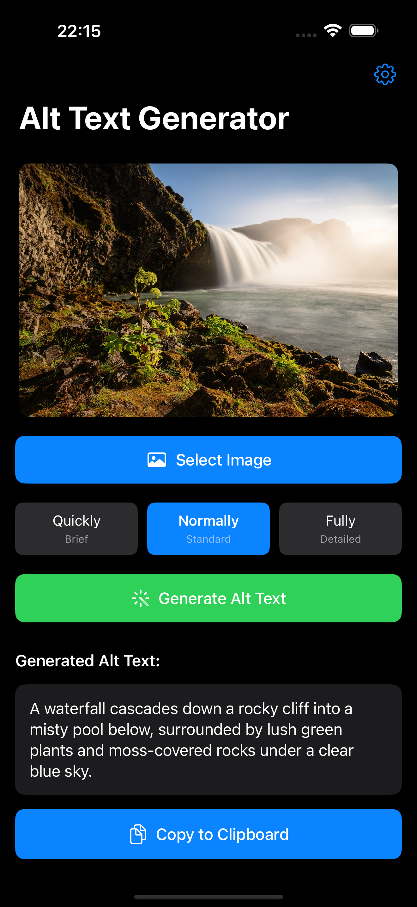
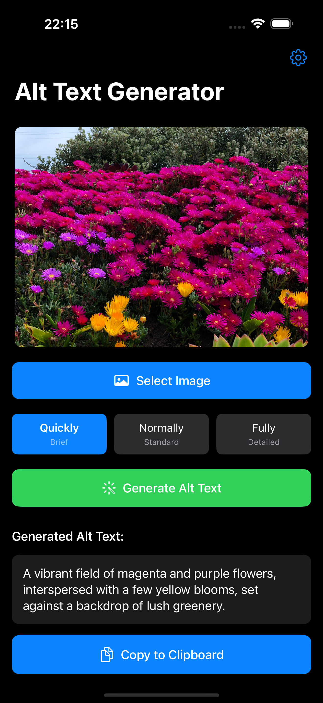
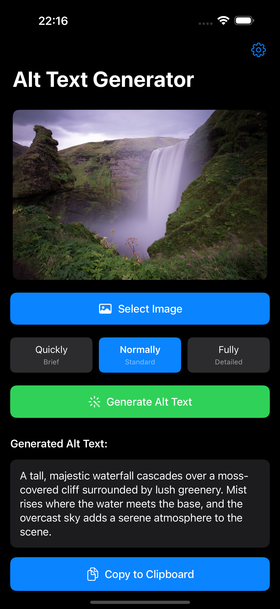
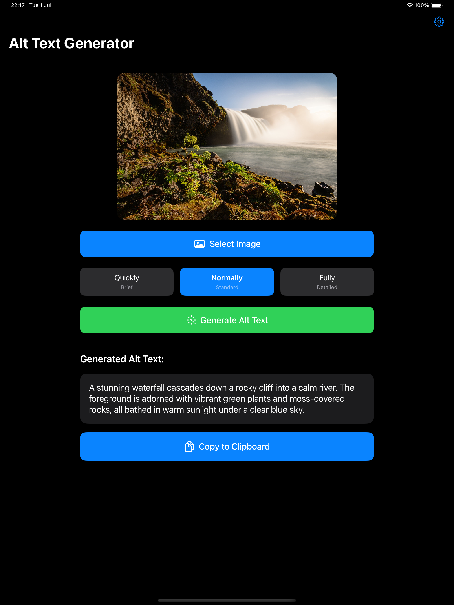
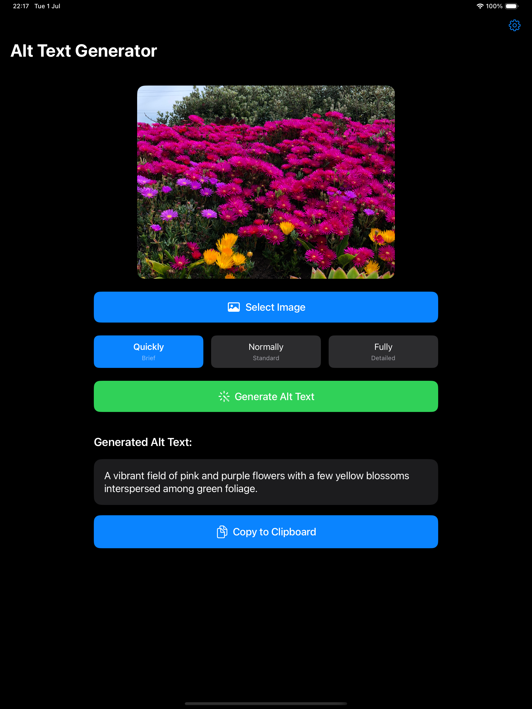
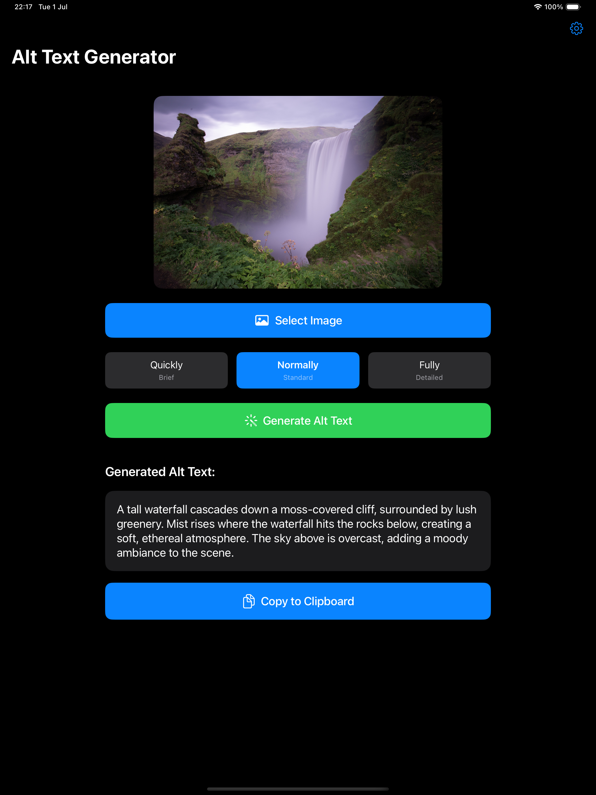
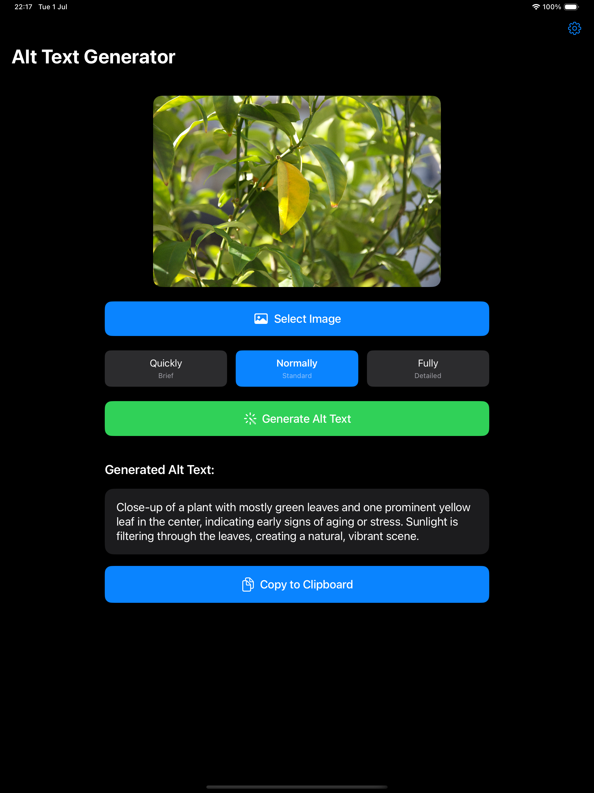

# Alt Text Generator

An iOS/iPadOS app that generates descriptive alt text for images using OpenAI's Vision API. Built with SwiftUI and designed with accessibility in mind.

## Features

- **AI-Powered Alt Text Generation**: Uses OpenAI's GPT-4 Vision model to create detailed, accessible descriptions of images
- **Multiple Image Support**: Process multiple images at once through the Shortcuts app
- **Shortcuts Integration**: Seamlessly integrates with Apple Shortcuts with customizable detail levels
- **Universal Design**: Optimized for both iPhone and iPad with adaptive layouts
- **Accessibility First**: Full VoiceOver support with descriptive labels and hints
- **Privacy Focused**: API keys stored securely in device keychain
- **Auto-Generate Option**: Automatically generate alt text when selecting an image
- **Auto-Copy Option**: Automatically copy generated text to clipboard
- **Detail Level Control**: Choose between quick, normal, or detailed descriptions
- **Smart API Key Setup**: Guided setup with automatic focus for accessibility

## Screenshots

### iPhone

  
  
  

### iPad

  
  

  
  

## Requirements

- iOS 17.0+ / iPadOS 17.0+
- OpenAI API key with GPT-4 Vision access
- Active OpenAI account with available credits

## Installation

1. Clone the repository
2. Open `AltTextGenerator.xcodeproj` in Xcode
3. Build and run on your device or simulator

## Setup

1. Launch the app
2. Tap the settings icon (⚙️) in the top right
3. Enter your OpenAI API key
4. Tap "Save API Key"

To get an OpenAI API key:
1. Visit [platform.openai.com](https://platform.openai.com)
2. Create an account or sign in
3. Navigate to API keys section
4. Create a new API key
5. Ensure you have credits in your account

## Usage

### In-App Usage
1. Tap "Select Image" to choose a photo from your library
2. Choose your preferred detail level (Quickly, Normally, or Fully)
3. Tap "Generate Alt Text" to create the description
4. Review the generated text
5. Tap "Copy to Clipboard" to copy the text

### Shortcuts Integration
The app provides a "Generate Alt Text" action for Shortcuts:
- Process single or multiple images
- Choose detail level: Quickly (brief), Normally (standard), or Fully (detailed)
- Returns combined alt text for all images
- Supports automation workflows

Example Shortcuts uses:
- Add alt text to photos before sharing
- Batch process images for accessibility
- Integrate with other apps via Shortcuts

## Privacy & Security

- API keys are stored securely in the iOS Keychain
- Images are processed locally and sent directly to OpenAI
- No data is stored or logged by the app
- Network requests use secure HTTPS connections

## Settings

- **API Key**: Your OpenAI API key (required)
- **Detail Level**: Default detail level for alt text generation (Quick/Normal/Full)
- **Auto-generate alt text**: Generate immediately after selecting an image
- **Auto-copy to clipboard**: Copy generated text automatically

## Accessibility

The app is fully accessible with VoiceOver:
- All UI elements have descriptive labels
- Actions provide helpful hints
- Status updates are announced
- Generated text is automatically read aloud

## Technical Details

- Built with SwiftUI
- Supports iOS 17+ App Intents framework
- Uses Swift Concurrency for async operations
- Implements proper security-scoped resource access
- Adaptive layouts for all device sizes

## License

This project is available under the MIT License.

## Version History

### v1.1.0
- **Detail Level Control**: Added three detail levels for customized alt text generation
  - Quickly: Brief, concise descriptions (1-2 sentences)
  - Normally: Standard descriptive text (default)
  - Fully: Comprehensive, detailed descriptions
- **Enhanced Shortcuts**: Detail level parameter now available in Shortcuts integration
- **Improved Accessibility**: Auto-focus API key field when prompted for better VoiceOver experience
- **Better UX**: Automatic keyboard dismissal and API key saving improvements
- **Smart Setup**: Startup alert guides new users to enter API key immediately
- Initial release
- Core alt text generation functionality
- Shortcuts integration with multiple image support
- iPad-optimized interface
- Full accessibility support
